# TacticalPtx — Informe de desarrollo y análisis por mes

**Producto:** Plataforma Push-to-Talk (PTT) independiente 
**Ubicación:** `D:\pulsanet` 
**Soporte / respaldos:** `D:\Soporte` 
**Fecha del informe:** 11 de agosto de 2026 
**API actual:** v1.4.0 

Este documento resume **qué se planificó, qué se entregó y qué se analizó** en cada mes del plan v1 (6 meses) y en las iteraciones posteriores (v1.1–v1.4).

---

## Visión general del plan

| | |
|---|---|
| Objetivo | Comunicación PTT por internet (voz, grupos, chat, ubicación, despacho) |
| Usuarios objetivo | ~1 000 |
| Plataformas | Web + Android (+ iOS cuando haya Mac) |
| Stack | Flutter · React/Vite · Node/Express · PostgreSQL · Redis · LiveKit · Socket.IO |
| Plazo base | 6 meses (Mes 1–6) |

```mermaid
flowchart LR
 M1[Mes 1 Auth + PTT web] --> M2[Mes 2 Presencia + chat]
 M2 --> M3[Mes 3 Android alpha]
 M3 --> M4[Mes 4 Despacho]
 M4 --> M5[Mes 5 Piloto / carga]
 M5 --> M6[Mes 6 Producción]
 M6 --> V11[v1.1 Media + GPS]
 V11 --> V12[v1.2 FCM código]
 V12 --> V13[v1.3 Geocercas]
 V13 --> V14[v1.4 Grabación PTT]
```



---

## Mes 1 — Fundación: auth, grupos y PTT web

### Objetivo de análisis
Validar que se puede hablar en un canal con **un solo hablante** (floor control) desde navegador, con usuarios demo.

### Entregado
- Backend Node/Express + PostgreSQL (orgs, users, groups, memberships)
- Auth JWT (login correo/contraseña)
- Tokens LiveKit por grupo
- Demo web: login, selección de canal, botón PTT
- Seed de cuentas demo (`admin`, `despacho`, `op1`–`op4` / `demo1234`)
- LiveKit local (`--dev`) + documentación de demo

### Análisis / resultados
- El camino crítico voz (cliente ↔ LiveKit ↔ clientes) funciona en LAN/localhost.
- Aún sin Redis: floor y presencia eran básicos / limitados.
- Sin app móvil ni panel de despacho.

### Docs
- `docs/DEMO_PTT_MES1.md`
- `docs/ALCANCE_V1.md`, `docs/PROPUESTA_TECNICA.md`, `docs/ARQUITECTURA.md`

### Estado
**Completado**

---

## Mes 2 — Presencia, chat y reconexión

### Objetivo de análisis
Endurecer el canal: saber **quién está en línea**, chat de texto y recuperación ante caídas de red.

### Entregado
- Redis: floor atómico PTT + presencia
- Chat de grupo (REST + Socket.IO tiempo real)
- Reconexión Socket.IO / reingreso a canal
- Health API con estado Redis
- Script `infra/start-services.ps1` (Redis Laragon + LiveKit)

### Análisis / resultados
- Varias pestañas pueden coordinar “quién habla” sin pisarse.
- Se identificó después (auditoría) presencia “fantasma” → corregido con heartbeat ~90 s.
- Chat sin multimedia todavía.

### Docs
- `docs/DEMO_MES2.md`

### Estado
**Completado** (+ endurecimiento posterior en auditoría)

---

## Mes 3 — Android alpha

### Objetivo de análisis
Llevar el mismo flujo PTT a un **teléfono Android** real (Wi‑Fi LAN al PC de desarrollo).

### Entregado
- App Flutter: login, grupos, canal PTT, presencia, chat
- LiveKit + Socket.IO en móvil
- `API_BASE` por `--dart-define` (IP LAN del PC)
- Guía USB / APK Wi‑Fi
- Ajustes de build (JDK 17, permisos mic/ubicación posteriores)

### Análisis / resultados
- Funciona en dispositivo físico; se detectaron **pérdidas de voz** en Wi‑Fi → mitigación con `--node-ip`, UDP 7882, mute/unmute del mic (no republish), DTX off.
- Java 25 del JBR de Android Studio rompe Kotlin → usar JDK 17 Microsoft.
- Disco C: lleno bloqueó builds → Gradle en `D:\Android\gradle-home`.

### Docs
- `docs/ANDROID_ALPHA_MES3.md`
- `docs/INSTALAR_APK_WIFI.md`, `docs/TELEFONO_USB.md`

### Estado
**Completado** (alpha usable; audio LAN mejorado)

---

## Mes 4 — Panel de despacho web

### Objetivo de análisis
Dar a admin/despachador una vista operativa: canales, usuarios, grupos y mapa.

### Entregado
- Rutas `/despacho` (overview), mapa Leaflet/OSM, usuarios, grupos
- API admin: overview, CRUD usuarios/grupos, CSV
- Roles: admin / dispatcher → consola; operator → radio
- Prep iOS documentada (sin Mac no hay build)

### Análisis / resultados
- Despacho útil para demo; mapa al inicio con datos seed / ubicaciones.
- iOS queda **bloqueado** por hardware/cuenta Apple.
- UX de despacho evolucionó después a consola tipo CommandCentral (ver post-v1).

### Docs
- `docs/DESPACHO_MES4.md`

### Estado
**Completado en web** · **iOS pendiente** (Mac)

---

## Mes 5 — Piloto y prueba de carga

### Objetivo de análisis
Comprobar que la **señalización** (Socket, floor, chat, presencia) aguanta orden de **~100 usuarios** concurrentes y dejar checklist de piloto.

### Entregado
- `npm run seed:load` (loaduser001…100)
- `npm run loadtest`
- Métricas / checklist piloto
- Validación de flujos login, LiveKit token, chat, overview, ubicaciones

### Análisis / resultados
- Loadtest operacional en local.
- Audio WebRTC a 100 usuarios reales no es el foco del script (señalización sí).
- Piloto de campo sigue dependiendo de Wi‑Fi/VPN estable y LiveKit bien anunciado (ICE).

### Docs
- `docs/PILOTO_MES5.md`

### Estado
**Completado** (herramientas de piloto)

---

## Mes 6 — Producción y endurecimiento

### Objetivo de análisis
Empaquetar para **despliegue** y cerrar huecos de seguridad/operación de v1.0.

### Entregado
- `infra/docker-compose.prod.yml` (Postgres, Redis, LiveKit, API, web, Caddy)
- API: rate limit, helmet, trust proxy, activity logs, JWT refresh
- Prep Play Store: keystore + guía AAB
- Manual de usuario y stub de privacidad
- Registro de devices (base para FCM)

### Análisis / resultados
- Compose listo; **Docker Desktop no instalado** en la PC de desarrollo (bloqueo UAC en un intento).
- Publicación real en tiendas y FCM activo requieren cuentas externas.
- Proyecto migrado/consolidado en **disco D:**; respaldo pre-cambio de C en Soporte.

### Docs
- `docs/PRODUCCION_MES6.md`, `docs/DOCKER_PROD.md`, `docs/PLAY_STORE.md`
- `docs/MANUAL_USUARIO.md`, `docs/PRIVACY.md`

### Estado
**Prep completada** · Deploy real pendiente de Docker/VPS

---

## Iteraciones posteriores a Mes 6 (producto v1.x)

Tras cerrar el esqueleto de 6 meses, se continuó el desarrollo incremental:

### v1.1 — Multimedia + GPS / rutas
| Qué | Detalle |
|-----|---------|
| Chat | Imágenes y archivos (límites 10 / 25 MB) |
| GPS | Web + Android → `POST /api/locations` |
| Mapa | Historial de ruta + socket `dispatch:location` |
| Doc | `docs/V1_1_MEDIA_GPS.md` |

### v1.2 — Push FCM (código)
| Qué | Detalle |
|-----|---------|
| Backend | Firebase Admin; push en chat/PTT; `/api/devices` |
| Móvil | Registro token, canal `tacticalptx_alerts`, foreground, refresh |
| Bloqueo | Credenciales Firebase + `google-services.json` (**pendiente a petición del usuario**) |
| Doc | `docs/FCM_PUSH.md`, `D:\Soporte\Documentos\ACTIVAR_FCM.md` |

### v1.3 — Geocercas
| Qué | Detalle |
|-----|---------|
| Modelo | Círculos por org; enter/exit en reporte GPS |
| UI | Crear/eliminar en mapa de despacho; alertas en vivo |
| Doc | `docs/V1_3_GEOFENCES.md` |

### v1.4 — Grabación PTT (web)
| Qué | Detalle |
|-----|---------|
| Cliente | MediaRecorder al soltar PTT en Radio web |
| API | `/api/recordings` list/upload/audio |
| Consola | Panel “Grabaciones PTT” + reproducir |
| Doc | `docs/V1_4_RECORDINGS.md` |

### UX consola y tema (transversal)
| Qué | Detalle |
|-----|---------|
| Consola | Rediseño tipo CommandCentral (mapa, canales, actividad, detalle) |
| Login | Split con marca fuerte |
| Tema | Claro / oscuro global (Login, Radio, Despacho), persistente |
| Audio LAN | LiveKit `--node-ip`, UDP, mute/unmute |

---

## Tabla resumen Mes 1–6

| Mes | Hito | Entrega principal | Estado |
|-----|------|-------------------|--------|
| 1 | PTT web + auth | Demo navegador, LiveKit, grupos | OK |
| 2 | Presencia + chat | Redis floor/online, chat, reconnect | OK |
| 3 | Android alpha | Flutter PTT en dispositivo | OK |
| 4 | Despacho | Panel admin/mapa/usuarios/grupos | OK (iOS no) |
| 5 | Piloto | Loadtest ~100 señalización | OK |
| 6 | Producción | Compose, harden, Play prep | Prep OK |

---

## Análisis transversal (hallazgos)

1. **Voz en LAN:** el fallo más frecuente no es el floor Redis sino **ICE/UDP** (LiveKit debe anunciar la IP Wi‑Fi del PC).
2. **Builds Android:** dependencia fuerte de JDK 17 y espacio en disco C:; herramientas pesadas mejor en D:.
3. **FCM:** cableado; valor de negocio aparece solo con proyecto Firebase real.
4. **iOS / stores:** fuera del entorno actual (sin Mac; cuentas developer).
5. **Docker:** archivos listos; falta runtime en la PC o un VPS.
6. **Separación producto/soporte:** código en `D:\pulsanet`; APK, secretos, informes y respaldos en `D:\Soporte`.

---

## Pendiente relevante (no bloquea demo local)

| Ítem | Dependencia |
|------|-------------|
| Activar FCM real | Firebase + JSON |
| Grabación PTT en app móvil | Mismo API; falta MediaRecorder Flutter |
| Deploy Docker/VPS | Docker o servidor |
| Play Store / App Store | Cuentas + revisión |
| iOS | Mac + Apple Developer |
| Interop radios MOTOTRBO | Fuera de alcance v1 |

---

## Cuentas demo

| Correo | Rol | Destino típico |
|--------|-----|----------------|
| `admin@tacticalptx.local` | admin | Despacho |
| `despacho@tacticalptx.local` | dispatcher | Despacho |
| `op1@` … `op4@tacticalptx.local` | operator | Radio / móvil |

Contraseña: `demo1234`

---

## Arranque diario (desarrollo)

```powershell
powershell -ExecutionPolicy Bypass -File D:\pulsanet\infra\start-services.ps1
cd D:\pulsanet\backend; npm run dev
cd D:\pulsanet\web; npm run dev
```

- Web: http://localhost:5173 
- Health: http://127.0.0.1:4000/api/health 

APK LAN (ejemplo): `D:\Soporte\APK\TacticalPtx-LAN.apk`

---

## Índice de documentación relacionada

| Documento | Contenido |
|-----------|-----------|
| `docs/ALCANCE_V1.md` | Alcance contractual / funcional |
| `docs/ARQUITECTURA.md` | Componentes y flujos |
| `docs/AUDITORIA_V1.md` | Estado real vs bugs |
| `docs/DEMO_PTT_MES1.md` … `PRODUCCION_MES6.md` | Guías por mes |
| `docs/V1_1_MEDIA_GPS.md` … `V1_4_RECORDINGS.md` | Incrementos |
| `D:\Soporte\Documentos\ACTIVAR_FCM.md` | Checklist Firebase |
| `D:\Soporte\Documentos\POST_CAMBIO_DISCO_C.md` | Post-migración disco |

---

*Informe generado para seguimiento de proyecto TacticalPtx. Actualizar este archivo cuando se cierre un nuevo hito mensual o versión.*
