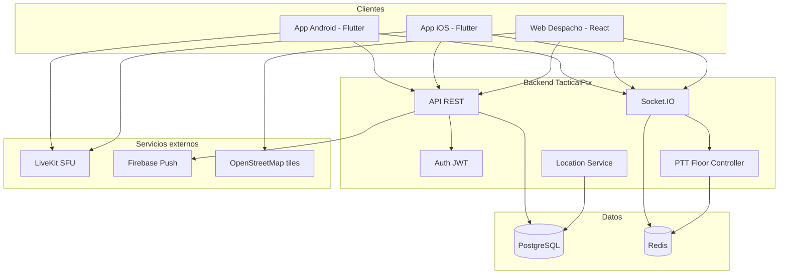

# TacticalPtx — Arquitectura del sistema

## Diagrama general



---

## Flujo PTT (presionar para hablar)

1. Usuario **presiona** botón PTT en app.
2. App envía `ptt:request` por Socket.IO al grupo.
3. Backend verifica: ¿hay otro speaker activo?
 - **No** → concede floor, emite `ptt:granted` al usuario.
 - **Sí** → emite `ptt:denied` (ocupado).
4. Usuario con floor **publica audio** a LiveKit room del grupo.
5. Resto del grupo **recibe audio** vía LiveKit subscribe.
6. Usuario **suelta** botón → `ptt:release` → libera floor.

---

## Modelo de datos (resumen)

Ver `database/schema.sql` para DDL completo.

| Entidad | Descripción |
|---------|-------------|
| `organizations` | Empresa/cliente (v1: una sola org) |
| `users` | Usuarios del sistema |
| `groups` | Canales PTT |
| `group_members` | Usuario ↔ grupo + rol |
| `messages` | Chat texto/media |
| `locations` | Histórico de ubicaciones |
| `ptt_sessions` | Log de sesiones PTT (auditoría) |
| `devices` | Tokens FCM por dispositivo |

---

## Estructura del repositorio

```
tacticalptx/
├── backend/ API Node.js + Socket.IO
├── mobile/ App Flutter (Android + iOS)
├── web/ Panel despacho React
├── database/ SQL schema y migraciones
├── docs/ Documentación
└── infra/ Docker, nginx (futuro)
```

---

## Seguridad v1

- HTTPS obligatorio en producción
- JWT con expiración corta + refresh token
- Contraseñas con bcrypt (cost 12)
- Rate limiting en login y API
- LiveKit tokens firmados por grupo (acceso solo a rooms autorizados)
- Validación de MIME en uploads
- **Texto:** AES-256-GCM de cuerpos de chat/DM en PostgreSQL (`CONTENT_ENCRYPTION_KEY`)
- **Voz:** DTLS-SRTP (WebRTC) + E2EE LiveKit por room (`LIVEKIT_E2EE_SECRET`)

---

## Escalabilidad (1,000 usuarios)

| Recurso | Estimación |
|---------|------------|
| RAM API | 2–4 GB |
| PostgreSQL | 4 GB RAM, 50 GB disco |
| Redis | 512 MB – 1 GB |
| LiveKit | Cloud managed o 4 vCPU dedicado |
| Conexiones WebSocket pico | ~200–400 simultáneas |

---

*TacticalPtx — Arquitectura v1 — 2026*
