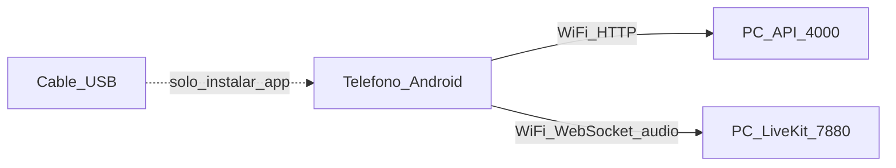

# Cómo correr TacticalPtx en el teléfono (USB)

## Qué significa

El **teléfono no es el servidor**. El servidor (API + Redis + LiveKit) corre en **tu PC**.

El cable USB solo sirve para **instalar y depurar** la app Flutter en el Android.

`--dart-define=API_BASE=http://192.168.1.77:4000` le dice a la app:

> “Habla con la API en la IP Wi‑Fi de mi PC, puerto 4000”

`192.168.1.77` es la IP de **esta** PC en la Wi‑Fi (puede cambiar si el router la renueva).



## Pasos

1. PC: Redis + LiveKit + `cd backend && npm run dev`
2. Teléfono y PC en **la misma Wi‑Fi**
3. Teléfono: Opciones de desarrollador → **Depuración USB** ON 
4. Conecta USB y acepta “¿Permitir depuración?”
5. En el PC:

```powershell
powershell -File D:\pulsanet\mobile\run-usb.ps1
```

El script detecta la IP actual y lanza `flutter run`.

Firewall: ya se abrieron TCP **4000**, **7880**, **7881** en esta máquina.

## Si no hay teléfono

`adb devices` vacío = no se puede hacer `flutter run` hasta que conectes uno.
